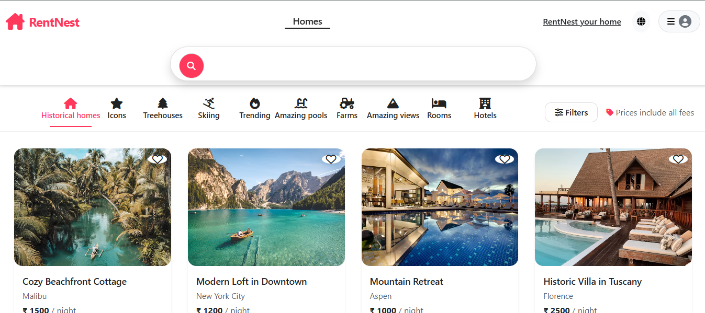
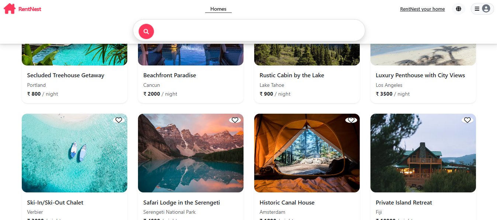
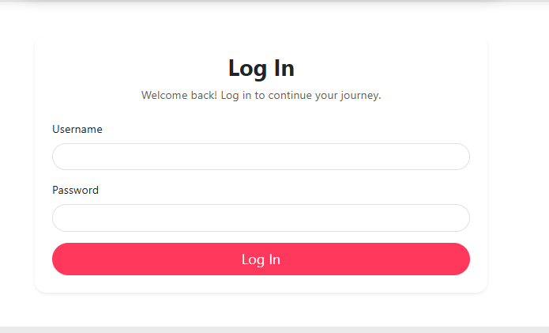

# 🏡 RentNest — Hotel Booking Platform

RentNest is a full-stack web application that allows users to discover, view, and book hotels or rental properties online. The project provides a user-friendly interface for browsing properties and managing bookings.

## 🚀 Features

* 🔐 User Registration & Login
* 🏨 Browse available hotels/properties
* 🔎 Search and explore properties
* 📄 View detailed property information
* 📅 Book properties
* 👤 User account management
* 🏠 Add and manage property listings
* 📱 Responsive design
* 🔒 Authentication and authorization
* 💾 Database integration
* ⚡ Fast and interactive user experience

## 🛠️ Tech Stack

### Frontend

* HTML
* CSS
* JavaScript
* EJS
* Bootstrap

### Backend

* Node.js
* Express.js

### Database

* MongoDB
* Mongoose

### Tools

* Git
* GitHub
* npm
* Nodemon

## 📂 Project Structure

```text
RentNest/
│
├── public/
│   ├── css/
│   ├── js/
│   └── images/
│
├── views/
│   ├── layouts/
│   ├── listings/
│   ├── users/
│   └── partials/
│
├── models/
│   ├── user.js
│   ├── listing.js
│   └── ...
│
├── routes/
│   ├── listings.js
│   ├── users.js
│   └── ...
│
├── controllers/
│   └── ...
│
├── utils/
│   └── ...
│
├── app.js
├── package.json
├── package-lock.json
└── README.md
```

> The exact folder structure may vary depending on your implementation.

## ⚙️ Installation & Setup

### 1. Clone the repository

```bash
git clone https://github.com/YOUR_USERNAME/RentNest.git
```

### 2. Navigate to the project

```bash
cd RentNest
```

### 3. Install dependencies

```bash
npm install
```

### 4. Configure environment variables

Create a `.env` file in the root directory:

```env
MONGO_URL=your_mongodb_connection_string
SESSION_SECRET=your_session_secret
```

Add any other environment variables required by your project.

### 5. Start the application

For development:

```bash
npm start
```

Or, if you use Nodemon:

```bash
npx nodemon app.js
```

The application will run locally at:

```text
http://localhost:3000
```

## 🔐 Environment Variables

Never upload your `.env` file to GitHub.

Make sure `.gitignore` contains:

```text
node_modules/
.env
```

## 📸 Screenshots

Add screenshots of your project here:

```markdown









```

## 🌟 Future Improvements

* 💳 Online payment integration
* ⭐ Property ratings and reviews
* 🔔 Booking notifications
* 🗺️ Map integration
* ❤️ Wishlist functionality
* 📊 Admin dashboard
* 📧 Email confirmation for bookings
* 📱 Improved mobile experience

## 👨‍💻 Author

**Mohammad Mahfooj**

Computer Science & Engineering (Artificial Intelligence)

### Connect With Me

* GitHub: [Your GitHub Profile](https://github.com/YOUR_USERNAME)
* LinkedIn: [Your LinkedIn Profile](https://linkedin.com/)

## 📄 License

This project is created for educational and portfolio purposes.
